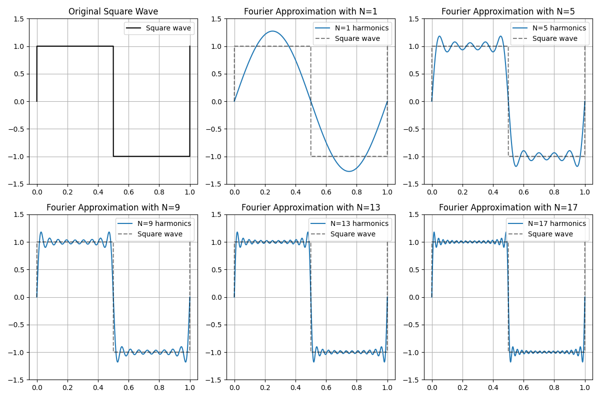
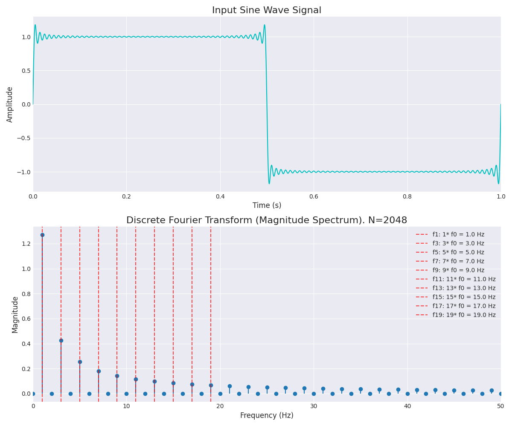
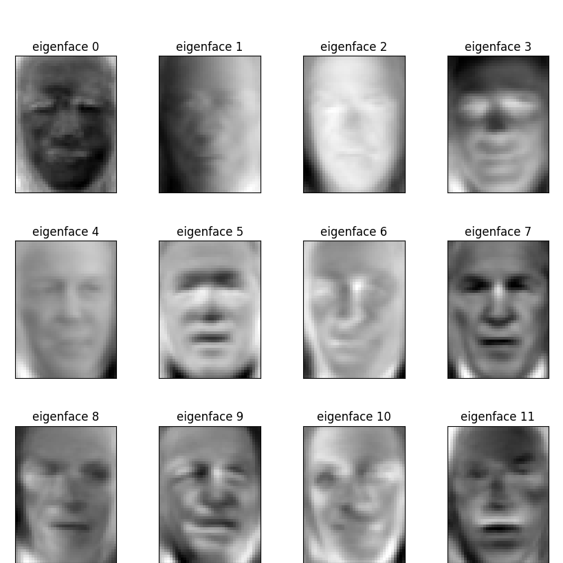
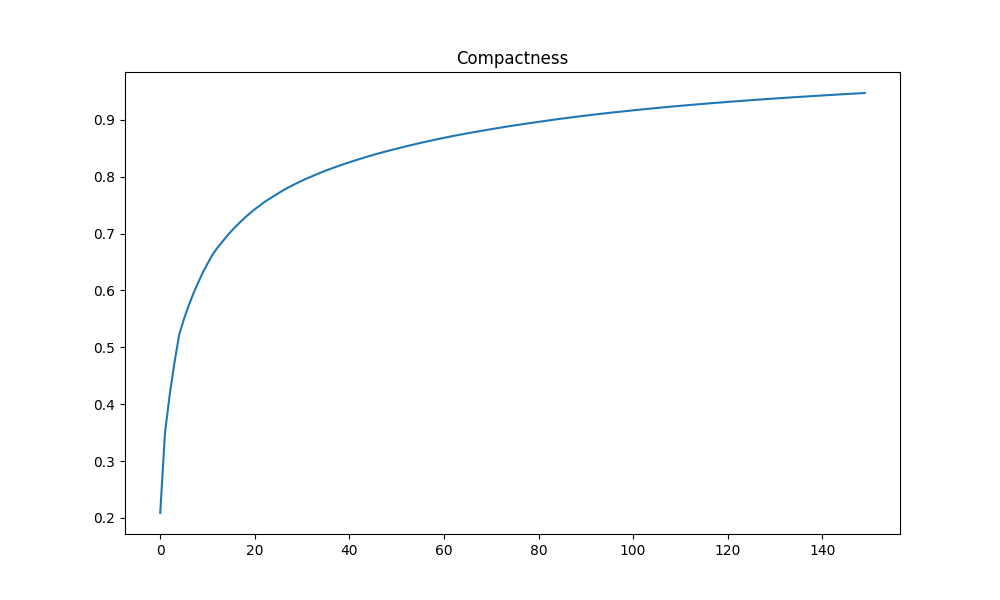
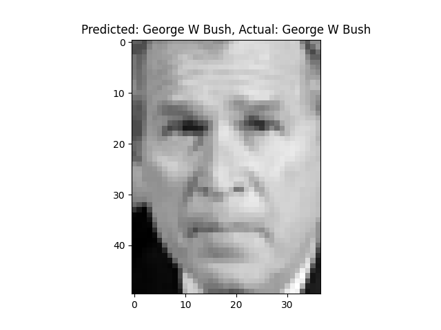
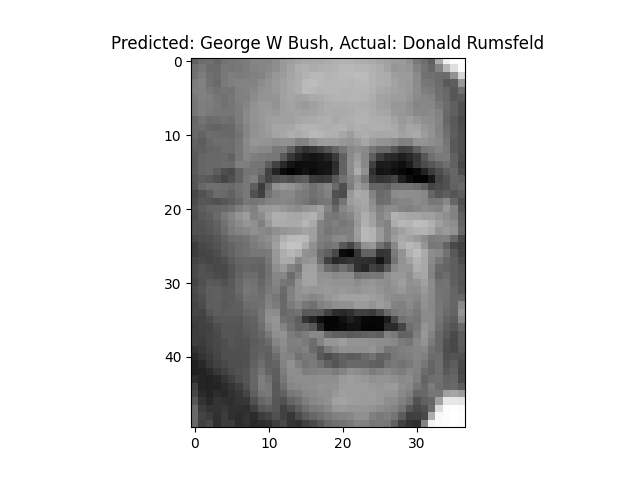
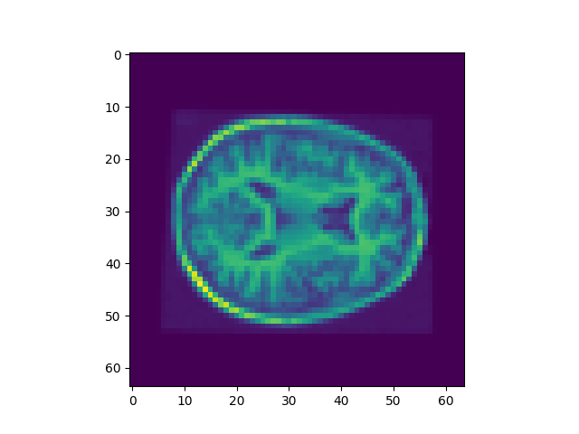
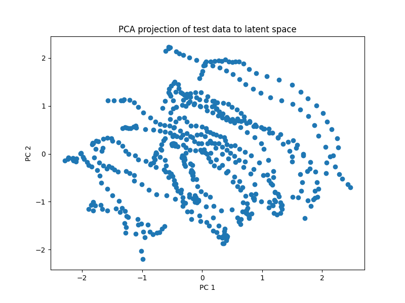
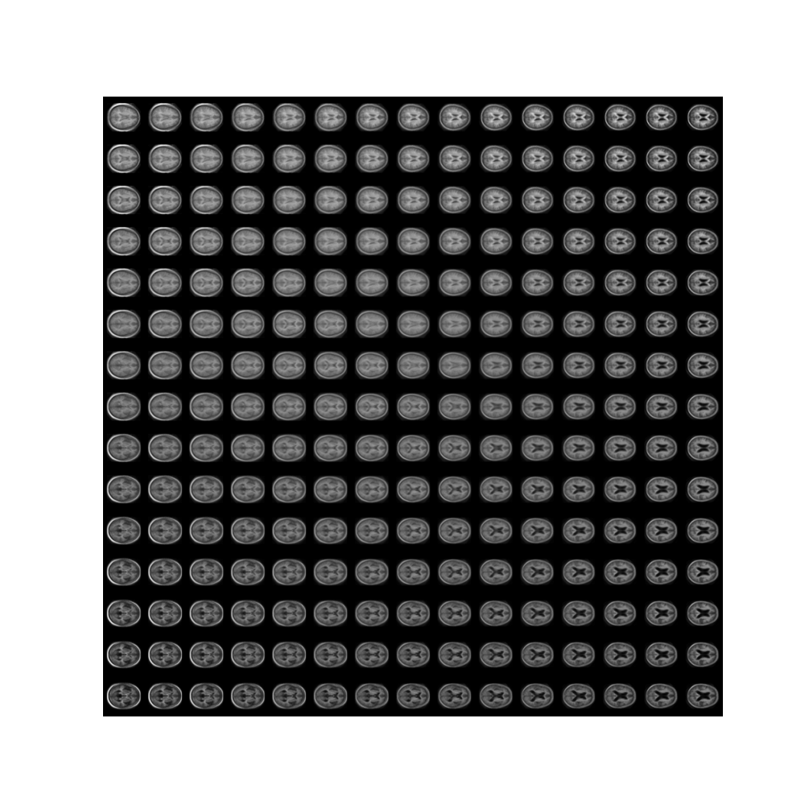

# Fourier

- Implemented function in pytorch by replacing numpy functions with torch functions, setting device to cuda, and running on the rangpur cluster. 
- The square wave plots show higher harmonics give a better representation of the original signal

- However the overall result plot shows the low harmonics have the highest proportions

- DFT is O(n2) so doubling n -> ~4x runtime. This is shown in logs. 

# Eigenfaces

- Calculating PCA using Pytorch was ~2x faster.
- 63% accuracy using a random forest classifier on the PCA-transformed data. 

# CNNs
## CNN Classifier
- I created a CNN with 2 convolution layers with 32 filters each, max pooling after each convolution, and a fully connected layer. 
- It gets around 80-85% accuracy

## Dawn Bench

After 5 epochs got 84%. I did 5 more and it was still at 84%.

# Recognition

## VAE
- Made up of 2 main components: encoder and decoder.
    - encoder takes an original data point and outputs a multivariate normal distribution ($\mu, \Sigma$).
    - the distribution itself is a member of the 'latent space'
    - the decoder takes a distribution in the latent space and recreates an image
    
- read images to 64x64 = dim 4096.
- made latent dimension 64. 

Original 

Reconstructed

- Reconstructed image loses some detail

Plot of the first two principal components of the mean vectors of the latent distributions where test images land.

Plot of how the encoder takes points from the latent and creates images. The x and y axes represent changes in the first two principal components of the means of the latent space from -3 to 3. The images show how the decoder makes an image from this mean in the latent space.

## UNet

