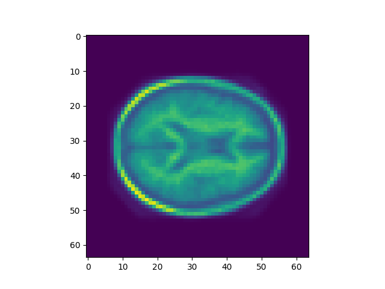

# Fourier

- Implemented function in pytorch by replacing numpy functions with torch functions, setting device to cuda, and running on the rangpur cluster. 
- The square wave plots show higher harmonics give a better representation of the original signal

- However the overall result plot shows the low harmonics have the highest proportions

- DFT is O(n2) so doubling n -> ~4x runtime. This is shown in logs. 

# Eigenfaces

- Calculating PCA using Pytorch was ~2x faster.
- 63% accuracy using a random forest classifier on the PCA-transformed data. 

# CNNs
## CNN Classifier
- I created a CNN with 2 convolution layers with 32 filters each, max pooling after each convolution, and a fully connected layer. 
- It gets around 80-85% accuracy

## Dawn Bench

# Recognition

## VAE
- read images to 64x64 = dim 4096.
- made latent dimension 64. 

Original 

Reconstructed

- Reconstructed image loses some detail

Plot of the first two principal components of the mean vectors of the latent distributions where test images land.
